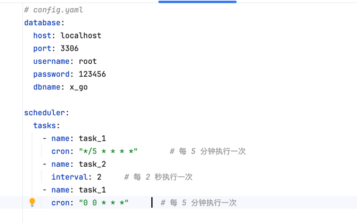
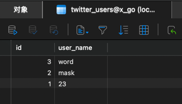
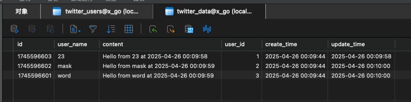
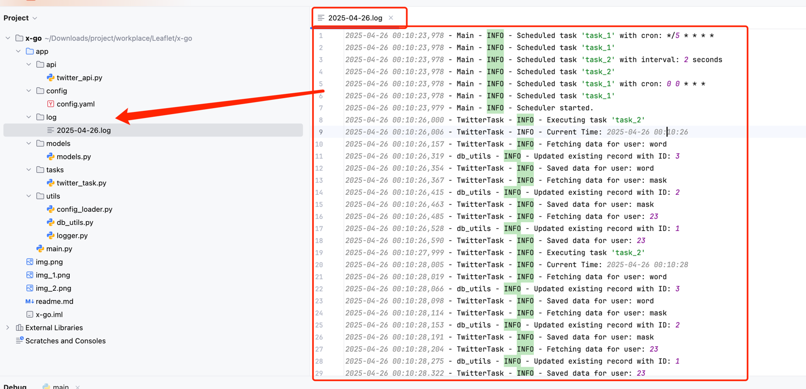
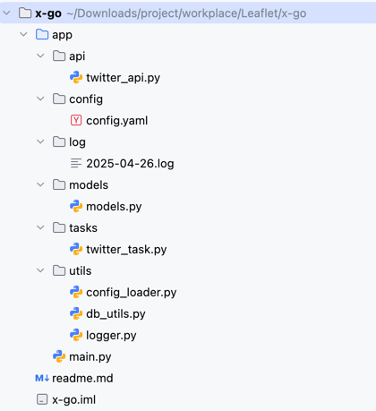

---


# 项目介绍
## 项目地址：
##结果展示

### 配置展示

### 数据库结果



###日志输出



## 1. 项目的目录结构
一个典型的项目目录结构如下所示：


## 2. Pip 需要安装的依赖
需要确保您的虚拟环境中已安装所有依赖。

## 3. 修改对应的数据库和 Cron 作业

### 数据库
确保您的数据库中存在 `twitter_users` 和 `twitter_data` 表。

```sql
CREATE TABLE `twitter_users` (
  `id` int NOT NULL,
  `user_name` varchar(100) DEFAULT NULL,
  PRIMARY KEY (`id` DESC)
) ENGINE=InnoDB DEFAULT CHARSET=utf8mb4 COLLATE=utf8mb4_0900_ai_ci;


INSERT INTO `twitter_users` (`id`, `user_name`) VALUES (3, 'word');
INSERT INTO `twitter_users` (`id`, `user_name`) VALUES (2, 'mask');
INSERT INTO `twitter_users` (`id`, `user_name`) VALUES (1, '23');

```

```sql

CREATE TABLE `twitter_data` (
  `id` int NOT NULL AUTO_INCREMENT,
  `user_name` varchar(100) DEFAULT NULL,
  `content` text CHARACTER SET utf8mb4 COLLATE utf8mb4_0900_ai_ci,
  `user_id` int DEFAULT NULL,
  `create_time` datetime DEFAULT NULL,
  `update_time` datetime DEFAULT NULL,
  PRIMARY KEY (`id` DESC)
) ENGINE=InnoDB AUTO_INCREMENT=1745596604 DEFAULT CHARSET=utf8mb4 COLLATE=utf8mb4_0900_ai_ci;
```

### Cron && database 配置文件

```yaml
# config.yaml
database:
  host: localhost
  port: 3306
  username: root
  password: 123456
  dbname: x_go

scheduler:
  tasks:
    - name: task_1
      cron: "*/5 * * * *"       # 每 5 分钟执行一次
    - name: task_2
      interval: 2     # 每 2 秒执行一次
    - name: task_1
      cron: "0 0 * * *"       # 每 5 分钟执行一次
```

## 3. 要运行的 API 和 main.py

### 运行 Flask API ，Mock数据
在项目根目录下运行 Flask 应用：
```bash
export FLASK_APP=app/api/twitter_api.py
flask run
```
or
```bash
python app/api/twitter_api.py
```

### 运行 main.py
`main.py` 中包含的任务可以通过传递参数直接运行：
```bash
python app/main.py
```

## 4. 日志输出的位置
日志输出默认位于项目的 `app/log/` 目录下。根据日期区分每天的日志情况。

